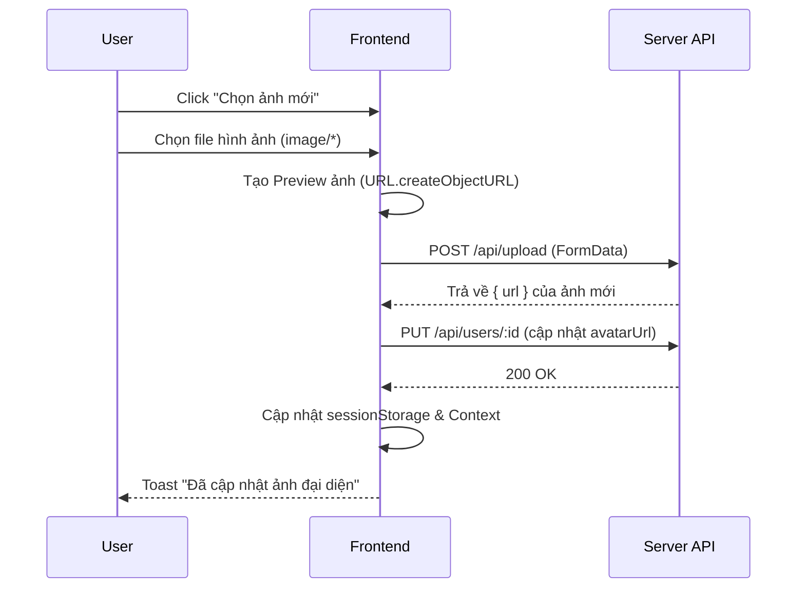
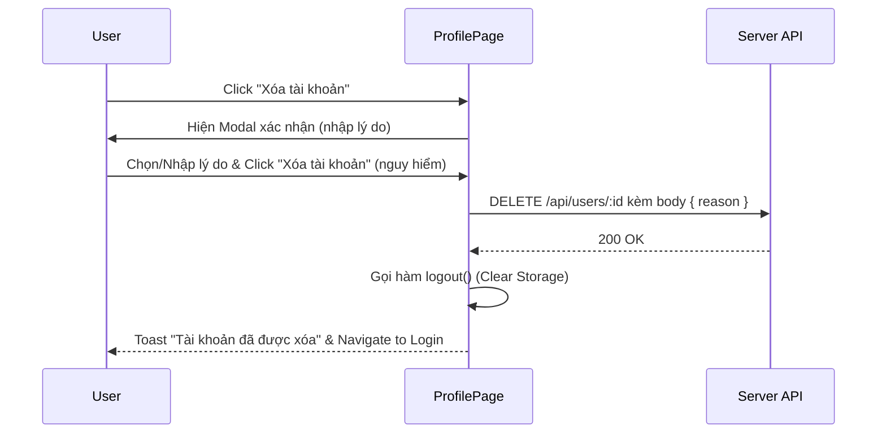
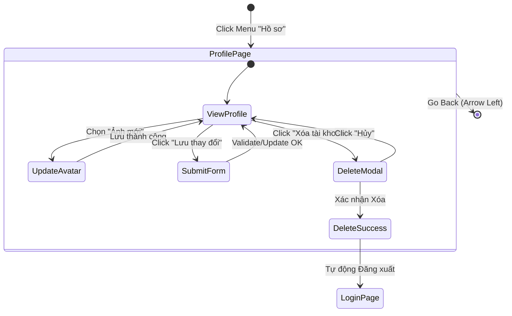

# Thiết kế chi tiết - Chức năng Hồ sơ cá nhân (Detail Design - Profile)

Tài liệu này mô tả chi tiết thiết kế cho trang Hồ sơ cá nhân và Quản lý tài khoản (Profile Page) trong ứng dụng **Smart Learn**.

## 1. Danh sách các hạng mục (Features List)

| STT | Hạng mục | Mô tả |
| :-- | :--- | :--- |
| 1 | **Chuỗi hoạt động (Streak)** | Hiển thị chuỗi ngày học liên tiếp (Streak) bằng icon ngọn lửa. |
| 2 | **Hoạt động tuần này (Week Data)** | Hiển thị biểu đồ hoạt động trong tuần hiện tại (Đã học / Chưa học). |
| 3 | **Cập nhật Ảnh đại diện (Avatar)** | Tải lên file ảnh từ thiết bị, tự động xem trước (preview) và cập nhật lên hệ thống. |
| 4 | **Sửa Thông tin cá nhân** | Cập nhật Tên hiển thị (Display Name) và Email học tập. Tên đăng nhập (Username) không được đổi. |
| 5 | **Thông tin Cấp độ (Education)** | Xem cấp độ học. Chỉ **Admin** mới có quyền thay đổi thông tin cấp độ của người dùng. |
| 6 | **Thông tin Gói Hội Viên** | Hiển thị thông tin Gói cước hiện tại (Plan), Ngày bắt đầu (Start Date), và Ngày hết hạn (End Date). |
| 7 | **Đổi mật khẩu** | Nhập Mật khẩu mới và Nhập lại mật khẩu để thay đổi bảo mật. |
| 8 | **Xóa tài khoản** | Modal xác nhận xóa tài khoản vĩnh viễn, yêu cầu người dùng chọn/nhập lý do rời đi. Tự động đăng xuất sau khi xóa. |

---

## 2. Danh sách Validate (Validation List)

### 2.1. Cập nhật thông tin cơ bản
- **Email**: Nếu nhập phải tuân thủ định dạng chuẩn (ví dụ: `abc@domain.com`).
- **Avatar**: Chỉ cho phép người dùng chọn tệp định dạng hình ảnh (`image/*`).
- **Mật khẩu**: 
    - Phải có tối thiểu **6 ký tự**.
    - Ô "Mật khẩu mới" và "Nhập lại mật khẩu" phải hoàn toàn khớp nhau.

### 2.2. Xóa tài khoản
- Yêu cầu bắt buộc chọn hoặc nhập một **lý do xóa tài khoản** (Radio group: Không có thời gian, Nội dung không phù hợp, Đổi tài khoản khác, Khác).
- Nếu chọn "Khác", người dùng phải nhập lý do vào ô Textarea.

---

## 3. Danh sách Message (Message List)

| Mã lỗi/Trạng thái | Nội dung thông báo (Tiếng Việt) |
| :--- | :--- |
| **Invalid Image** | "Vui lòng chọn một tệp hình ảnh." |
| **Upload Avatar Success** | "Đã cập nhật ảnh đại diện" |
| **Upload Avatar Fail** | "Không thể tải ảnh lên: [Chi tiết lỗi]" |
| **Invalid Email** | "Địa chỉ email không hợp lệ." |
| **Short Password** | "Mật khẩu phải có ít nhất 6 ký tự." |
| **Password Mismatch** | "Mật khẩu và nhập lại mật khẩu không khớp." |
| **Profile Update Success** | "Cập nhật thông tin cá nhân thành công" |
| **Profile Update Fail** | "Không thể cập nhật thông tin" / "Đã xảy ra lỗi" |
| **Password Change Fail** | "Không thể đổi mật khẩu" |
| **Delete Account Success** | "Tài khoản của bạn đã được xóa thành công." |
| **Delete Account Fail** | "Không thể xóa tài khoản" |

---

## 4. Danh sách API (API Endpoints)

| Method | Endpoint | Mô tả |
| :--- | :--- | :--- |
| `GET` | `/api/me` | Tự động gọi khi mount component để đồng bộ hóa dữ liệu mới nhất (đặc biệt là educationLevel, plan, planEndDate). |
| `POST` | `/api/upload` | Tải file ảnh đại diện lên server, trả về `url` ảnh. |
| `PUT` | `/api/users/:id` | Lưu các trường: `displayName`, `email`, `avatarUrl`. (Được gọi bên dưới hook `updateUser`). |
| `PUT` | `/api/users/:id/password` | API xử lý cập nhật mật khẩu riêng biệt (`changePassword`). |
| `DELETE` | `/api/users/:id` | Xóa tài khoản người dùng, có gửi kèm `body: { reason }`. |

---

## 5. Flow Diagram (Luồng chức năng)

### 5.1. Luồng Cập nhật Ảnh đại diện

### 5.2. Luồng Xóa Tài khoản

---

## 6. Sơ đồ liên kết màn hình (Navigation Flow)

