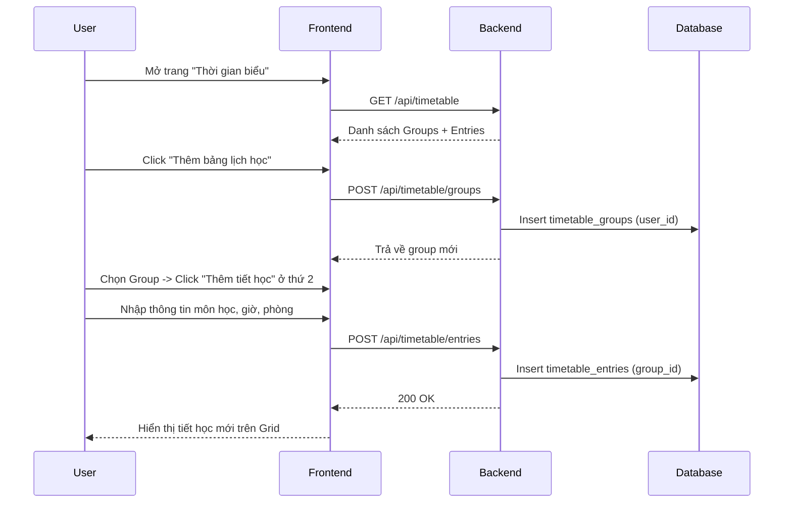
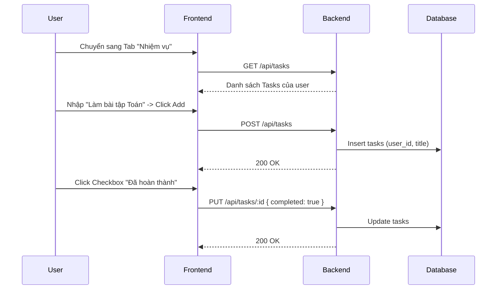
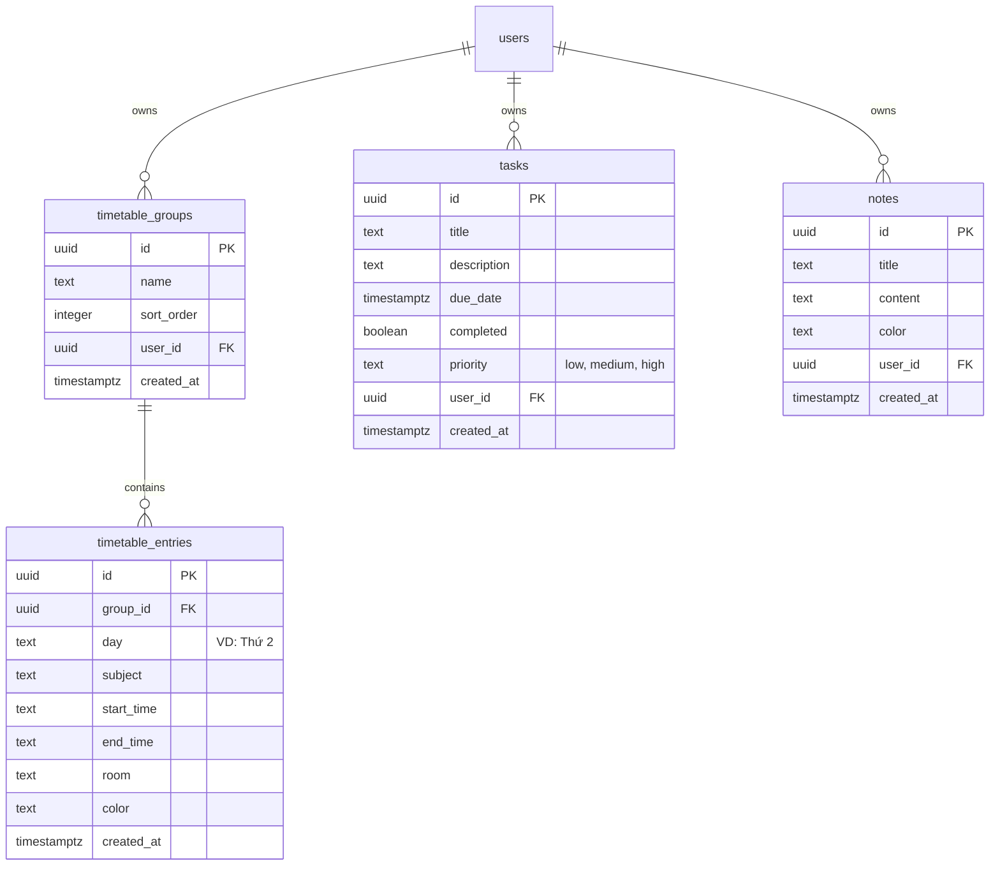

# Thiết kế chi tiết - Chức năng Thời khóa biểu & Quản lý Cá nhân (Detail Design - Schedule)

Tài liệu này mô tả chi tiết thiết kế cho hệ thống quản lý lịch trình và cá nhân (Thời khóa biểu, Nhiệm vụ, Ghi chú) trong ứng dụng **Smart Learn**.

## 1. Danh sách các hạng mục (Features List)

| STT | Hạng mục | Mô tả |
| :-- | :--- | :--- |
| 1 | **Quản lý Nhóm Lịch học (Timetable Groups)** | Tạo, sửa đổi tên và xóa các nhóm lịch học (VD: Lịch học chính, Lịch học thêm). Xóa nhóm sẽ xóa toàn bộ các tiết học bên trong. |
| 2 | **Quản lý Tiết học (Timetable Entries)** | Thêm, sửa, xóa các tiết học theo thứ trong tuần. Các trường gồm: Môn học, Thời gian (Bắt đầu - Kết thúc), Phòng học, và Màu sắc nhãn. |
| 3 | **Quản lý Nhiệm vụ (Tasks)** | Giao diện danh sách (To-Do List). Thêm nhiệm vụ với Tiêu đề, Mô tả chi tiết (hỗ trợ xuống dòng), Ngày đến hạn (Due date), và Độ ưu tiên (Low/Medium/High). Đánh dấu hoàn thành. |
| 4 | **Quản lý Ghi chú (Notes)** | Tạo các thẻ ghi chú nhanh với Tiêu đề, Nội dung, và nhãn Màu sắc. Trình bày dạng lưới (Masonry/Grid). |
| 5 | **Phân lập dữ liệu (Data Isolation)** | Toàn bộ dữ liệu Thời khóa biểu, Nhiệm vụ, Ghi chú được gắn với `user_id` của người dùng hiện tại. Người dùng chỉ xem và chỉnh sửa dữ liệu của chính mình. |

---

## 2. Danh sách Validate (Validation List)

### 2.1. Thời khóa biểu (Timetable)
- **Tên nhóm (Group Name)**: Không được để trống.
- **Tiết học (Entry)**:
  - **Môn học (subject)**: Bắt buộc.
  - **Thời gian (start_time, end_time)**: Bắt buộc. Giờ bắt đầu không được lớn hơn giờ kết thúc (Validate ở UI).
  - **Thứ (day)**: Phải thuộc tập hợp các ngày hợp lệ ("Thứ 2", "Thứ 3", "Thứ 4", "Thứ 5", "Thứ 6", "Thứ 7", "Chủ nhật").
  - **Phòng học, Màu sắc**: Tùy chọn (Optional).
- **Mã màu các ngày (Day Colors)**:
  - **Thứ 2**: Xanh dương (#3b82f6)
  - **Thứ 3**: Xanh lục (#10b981)
  - **Thứ 4**: Tím (#8b5cf6)
  - **Thứ 5**: Cam (#f97316)
  - **Thứ 6**: Hồng (#ec4899)
  - **Thứ 7**: Xanh lơ (#06b6d4)
  - **Chủ nhật**: Đỏ hồng (#f43f5e)

### 2.2. Nhiệm vụ (Tasks)
- **Tiêu đề (title)**: Bắt buộc, không được để trống.
- **Độ ưu tiên (priority)**: Nhận một trong các giá trị: `low`, `medium`, `high`. Mặc định là `medium`.
- **Mô tả (description)**: Tùy chọn, hỗ trợ text nhiều dòng.

### 2.3. Ghi chú (Notes)
- **Tiêu đề (title)**: Tùy chọn (nếu không nhập sẽ lấy dòng đầu của nội dung hoặc để "Không có tiêu đề").
- **Nội dung (content)**: Bắt buộc.
- **Màu sắc (color)**: Tùy chọn.

---

## 3. Quy chuẩn Giao diện (UI Standards)

### 3.1. Các nút hành động (Buttons)
- **Nút "Hủy" (Cancel)**: Luôn sử dụng viền đỏ, chữ đỏ (`border-red-500 text-red-500`) và hover nền hồng nhạt (`hover:bg-red-50`).
- **Nút "Thêm mới" (Add)**: Sử dụng màu xanh emerald (`bg-emerald-600`), có bóng đổ (`shadow-emerald-600/20`). Icon dấu cộng (`Plus`) có hiệu ứng xoay (`group-hover:rotate-90`) khi di chuột.
- **Nút "Lưu" (Save)**: Sử dụng màu chủ đạo (Primary) của hệ thống.

### 3.2. Trình bày nội dung
- **Thời khóa biểu**: Chia thành 2 cột **Sáng** (trước 12:00) và **Chiều** (từ 12:00 trở đi) để dễ dàng quản lý.
- **Nhiệm vụ**: Phân loại theo trạng thái (Tất cả, Đang làm, Hoàn thành) với các màu sắc nhãn ưu tiên (Đỏ cho Cao, Vàng cho Trung bình, Xanh cho Thấp).

---

## 4. Danh sách Message (Message List)

| Mã lỗi/Trạng thái | Nội dung thông báo (Tiếng Việt) |
| :--- | :--- |
| **Timetable Save Success** | "Đã lưu thời khóa biểu" / "Cập nhật thành công" |
| **Timetable Save Fail** | "Không thể lưu thời khóa biểu" |
| **Timetable Delete Confirm** | "Xóa lịch học này?" |
| **Group Delete Confirm** | "Xóa nhóm lịch học này? Tất cả các tiết học bên trong sẽ bị xóa." |
| **Task Create Success** | "Đã thêm nhiệm vụ" |
| **Task Update Success** | "Đã cập nhật nhiệm vụ" |
| **Task Delete Confirm** | "Xóa nhiệm vụ này?" |
| **Note Create Success** | "Đã lưu ghi chú" |
| **Note Delete Confirm** | "Xóa ghi chú này?" |

---

## 5. Danh sách API (API Endpoints)

### 4.1. Timetable (Thời khóa biểu)

| Method | Endpoint | Mô tả |
| :--- | :--- | :--- |
| `GET` | `/api/timetable` | Lấy danh sách toàn bộ Group và các Entry (tiết học) bên trong. |
| `POST` | `/api/timetable/groups` | Tạo một nhóm lịch học mới. |
| `PUT` | `/api/timetable/groups/:id` | Cập nhật tên hoặc thứ tự (sort_order) của nhóm. |
| `DELETE` | `/api/timetable/groups/:id` | Xóa nhóm lịch học (CASCADE xóa entries). |
| `POST` | `/api/timetable/entries` | Thêm tiết học mới vào một nhóm. |
| `PUT` | `/api/timetable/entries/:id` | Cập nhật thông tin tiết học. |
| `DELETE` | `/api/timetable/entries/:id` | Xóa tiết học. |

### 4.2. Tasks (Nhiệm vụ)

| Method | Endpoint | Mô tả |
| :--- | :--- | :--- |
| `GET` | `/api/tasks` | Lấy danh sách nhiệm vụ của user hiện tại. |
| `POST` | `/api/tasks` | Tạo nhiệm vụ mới. |
| `PUT` | `/api/tasks/:id` | Cập nhật nhiệm vụ (đổi tên, mô tả, trạng thái hoàn thành). |
| `DELETE` | `/api/tasks/:id` | Xóa nhiệm vụ. |

### 4.3. Notes (Ghi chú)

| Method | Endpoint | Mô tả |
| :--- | :--- | :--- |
| `GET` | `/api/notes` | Lấy danh sách ghi chú của user hiện tại. |
| `POST` | `/api/notes` | Tạo ghi chú mới. |
| `PUT` | `/api/notes/:id` | Cập nhật ghi chú (tiêu đề, nội dung, màu sắc). |
| `DELETE` | `/api/notes/:id` | Xóa ghi chú. |

---

## 6. Flow Diagram (Luồng chức năng)

### 5.1. Luồng Quản lý Thời khóa biểu đa nhóm

### 5.2. Luồng Quản lý Nhiệm vụ (To-Do)

---

## 7. Database Schema

### 6.1. Quan hệ giữa các bảng

---

## 8. Case sử dụng (Usecases)

### UC-01: Thêm lịch học ở trường và lịch học thêm
- **Actor**: Học sinh (User).
- **Mô tả**: Quản lý độc lập lịch học trên lớp và lịch học ngoài giờ.
- **Hành động**: Đổi tên nhóm mặc định thành "Lịch học trên lớp". Click "Thêm bảng lịch học" mới -> Đặt tên "Lịch học thêm". Thêm các môn Toán, Văn vào lịch trên lớp. Thêm môn Anh vào lịch học thêm ở trung tâm.
- **Kết quả**: Giao diện hiển thị 2 bảng grid thời khóa biểu tách biệt.

### UC-02: Tạo nhiệm vụ có ghi chú nhiều dòng
- **Actor**: Người dùng.
- **Mô tả**: Tạo một task nhắc nhở nộp bài tập lớn với nhiều yêu cầu nhỏ.
- **Hành động**: Sang tab Nhiệm vụ. Click "Thêm nhiệm vụ". Nhập Tiêu đề. Nhấn Edit (biểu tượng bút) để mở modal chi tiết -> Nhập description dài với các gạch đầu dòng -> Chọn Priority là High -> Chọn Due Date -> Lưu.
- **Kết quả**: Task hiển thị trong danh sách. Khi click mở rộng, nội dung description hiển thị chính xác các dòng gạch đầu dòng đã nhập.

### UC-03: Viết ghi chú nhanh (Stickies)
- **Actor**: Người dùng.
- **Mô tả**: Lưu lại ý tưởng hoặc lời dặn của giáo viên.
- **Hành động**: Sang tab Ghi chú. Gõ nội dung vào ô "Viết ghi chú mới...". Có thể tùy chọn màu nền. Nhấn Enter/Save.
- **Kết quả**: Ghi chú xuất hiện ở dưới dạng Grid masonry.
