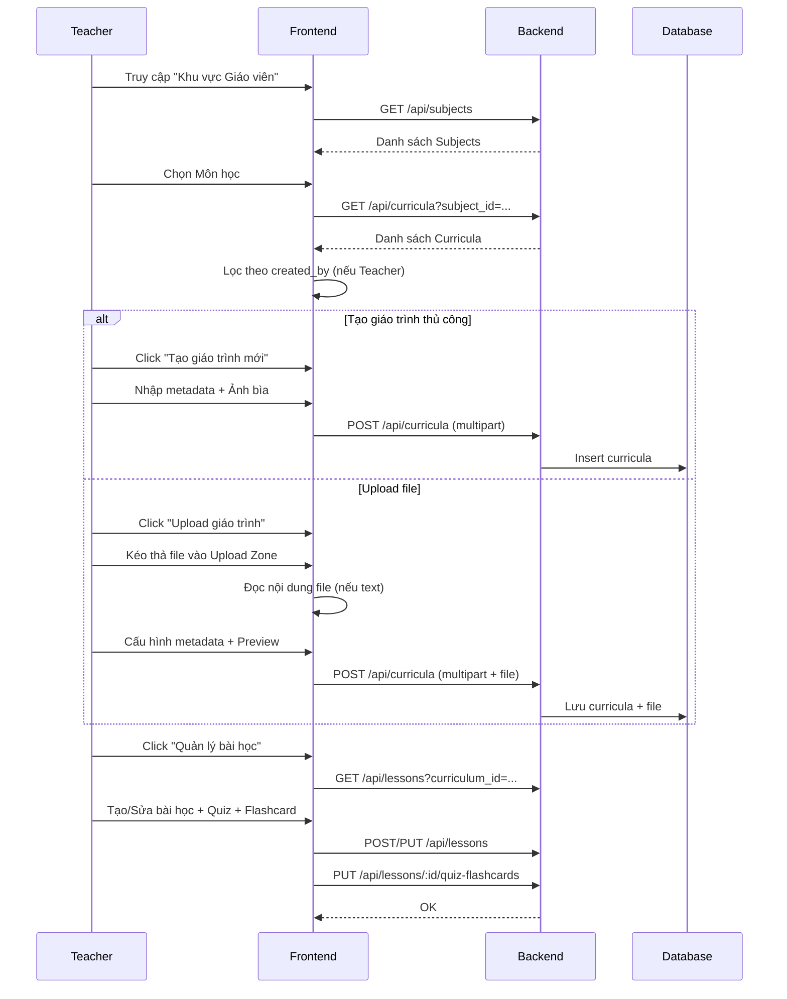
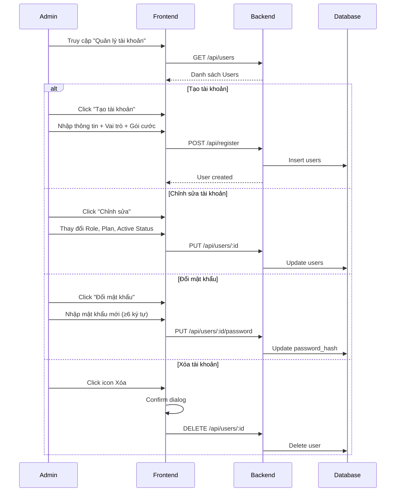
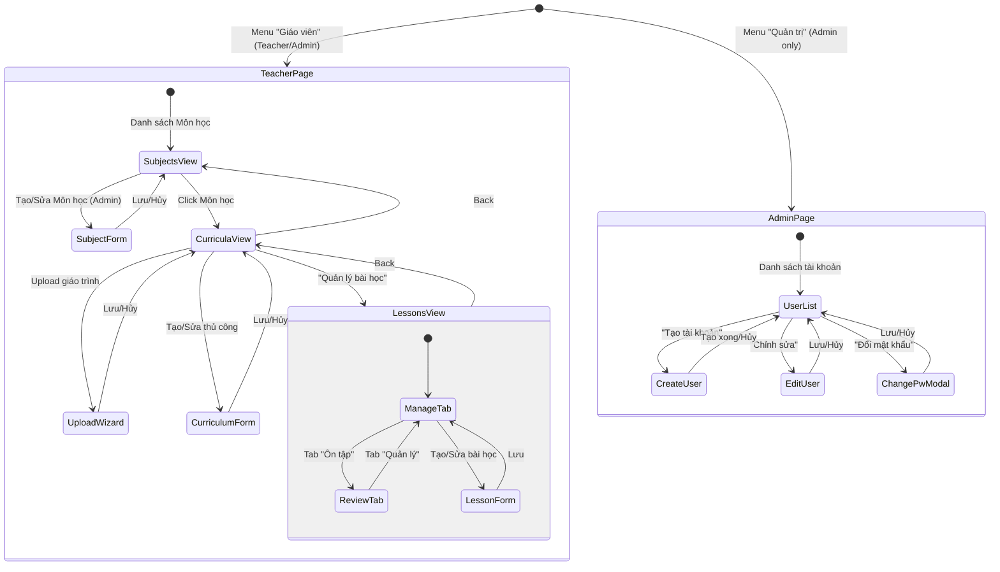

# Thiết kế chi tiết - Chức năng Giáo viên & Quản trị (Detail Design - Teacher & Admin)

Tài liệu này mô tả chi tiết thiết kế cho hệ thống quản lý nội dung dành cho Giáo viên (Teacher) và quản lý tài khoản dành cho Quản trị viên (Admin) trong ứng dụng **Smart Learn**.

## 1. Danh sách các hạng mục (Features List)

### 1.1. Khu vực Giáo viên (TeacherPage)

| STT | Hạng mục | Mô tả |
| :-- | :--- | :--- |
| 1 | **Quản lý Môn học** | Hiển thị danh sách môn học. Admin có thể CRUD và kéo thả sắp xếp (Drag & Drop). Teacher chỉ xem. |
| 2 | **Quản lý Giáo trình** | CRUD giáo trình: Tên, NXB, Cấp độ, Lớp, Ảnh bìa, File đính kèm, Chế độ hiển thị. Admin kéo thả sắp xếp. |
| 3 | **Upload Wizard** | Tạo giáo trình từ file: Chọn file → Cấu hình metadata → Preview → Lưu. Hỗ trợ text/CSV/JSON. |
| 4 | **Quản lý Bài học** | Tạo/Sửa/Xóa bài học trong giáo trình — giống Study nhưng trong giao diện Teacher. |
| 5 | **Soạn Quiz & Flashcard** | Thêm trắc nghiệm, flashcard và hình ảnh slide vào mỗi bài học. Import flashcard CSV. |
| 6 | **Chế độ Ôn tập** | Tab Ôn tập với 4 sub-tab: Nội dung, Trắc nghiệm, Flashcard, Tổng kết. Đánh dấu tiến độ. |
| 7 | **Phân quyền nội dung** | Teacher chỉ thấy giáo trình mình tạo. Admin thấy tất cả giáo trình. |

### 1.2. Quản trị Tài khoản (AdminPage)

| STT | Hạng mục | Mô tả |
| :-- | :--- | :--- |
| 8 | **Danh sách tài khoản** | Hiển thị tất cả User với Role Badge, trạng thái Active, và ngày tạo. |
| 9 | **Tạo tài khoản** | Form full-screen tạo user mới: Username, Display Name, Email, Cấp độ, Gói cước, Vai trò. |
| 10 | **Chỉnh sửa tài khoản** | Form full-screen sửa thông tin: Display Name, Email, Vai trò, Gói cước, Trạng thái (Active/Locked). |
| 11 | **Đổi mật khẩu** | Modal đổi mật khẩu cho bất kỳ user (Admin thay đổi, không cần mật khẩu cũ). |
| 12 | **Xóa tài khoản** | Xóa user (không cho xóa chính mình hoặc tài khoản `admin` gốc). |
| 13 | **Quản lý Gói cước** | Thiết lập Plan (Miễn phí, 1-12 tháng), tự động tính ngày kết thúc. |

---

## 2. Danh sách Validate (Validation List)

### 2.1. Quản lý Môn học (Admin only)
- **Tên môn học**: Không được để trống.
- **Quyền**: Chỉ Admin mới có thể Tạo/Sửa/Xóa môn học.

### 2.2. Quản lý Giáo trình
- **Tên giáo trình**: Không được để trống.
- **Môn học (subject_id)**: Bắt buộc (được tự động gắn từ context).
- **Quyền chỉnh sửa/xóa**: Chỉ Owner hoặc Admin.
- **Phạm vi xem**: Teacher chỉ thấy giáo trình `created_by === user.id`. Admin thấy tất cả.

### 2.3. Quản lý Bài học
- **Tên bài học**: Không được để trống.
- **Quiz**: Câu hỏi phải có nội dung + ít nhất 2 phương án.
- **Flashcard**: Cả front và back phải có nội dung sau khi trim.
- **Hình ảnh**: Chỉ upload được khi bài học đã lưu (có ID).

### 2.4. Tạo tài khoản (Admin)
- **Username**: Bắt buộc, duy nhất.
- **Mật khẩu**: Tối thiểu 6 ký tự. Mật khẩu và Nhập lại phải khớp.
- **Email**: Nếu nhập, phải đúng format (regex: `^[^\s@]+@[^\s@]+\.[^\s@]+$`).

### 2.5. Chỉnh sửa tài khoản
- **Email**: Nếu nhập, phải đúng format.
- **Username**: Không cho phép sửa (readonly).

### 2.6. Đổi mật khẩu
- **Mật khẩu mới**: Tối thiểu 6 ký tự.

---

## 3. Danh sách Message (Message List)

### 3.1. Teacher — Quản lý nội dung

| Trạng thái | Nội dung thông báo |
| :--- | :--- |
| **Subject Delete Confirm** | "Xóa môn học này? Tất cả giáo trình và bài học liên quan sẽ bị xóa." |
| **Curriculum Delete Confirm** | "Xóa giáo trình này? Toàn bộ bài học trong giáo trình sẽ bị xóa." |
| **Curriculum Name Required** | "Vui lòng nhập tên giáo trình" |
| **Curriculum Save Fail** | "Lỗi khi lưu giáo trình" / "Không thể lưu giáo trình" |
| **Lesson Title Required** | "Vui lòng nhập tên bài học" |
| **Lesson Save Fail** | "Không thể lưu bài học. Vui lòng thử lại." |
| **Lesson Delete Confirm** | "Bạn có chắc muốn xóa bài học này?" |
| **Image Upload Fail** | "Không thể upload ảnh. Vui lòng thử lại." |
| **Image Delete Fail** | "Không thể xóa ảnh." |

### 3.2. Admin — Quản lý tài khoản

| Trạng thái | Nội dung thông báo |
| :--- | :--- |
| **Create Success** | "Đã tạo tài khoản \"[username]\"" |
| **Update Success** | "Đã cập nhật tài khoản \"[username]\"" |
| **Delete Confirm** | "Xóa tài khoản \"[displayName]\" (@[username])?" |
| **Delete Success** | "Đã xóa tài khoản" |
| **Password Changed** | "Đã đổi mật khẩu thành công" |
| **Password Mismatch** | "Mật khẩu và nhập lại mật khẩu không khớp." |
| **Invalid Email** | "Địa chỉ email không hợp lệ." |

---

## 4. Danh sách API (API Endpoints)

### 4.1. Quản lý Môn học (Admin only)

| Method | Endpoint | Mô tả |
| :--- | :--- | :--- |
| `GET` | `/api/subjects` | Lấy danh sách tất cả môn học. |
| `POST` | `/api/subjects` | Tạo môn học mới. |
| `PUT` | `/api/subjects/:id` | Cập nhật môn học. |
| `DELETE` | `/api/subjects/:id` | Xóa môn học (CASCADE tất cả giáo trình + bài học). |
| `PUT` | `/api/subjects/reorder` | Sắp xếp lại thứ tự hiển thị. |

### 4.2. Quản lý Giáo trình (Teacher + Admin)

| Method | Endpoint | Mô tả |
| :--- | :--- | :--- |
| `GET` | `/api/curricula?subject_id=...` | Lấy danh sách giáo trình. Teacher lọc client-side theo `created_by`. |
| `POST` | `/api/curricula` | Tạo giáo trình (hỗ trợ multipart form: file + ảnh bìa). |
| `PUT` | `/api/curricula/:id` | Cập nhật metadata giáo trình (**Owner/Admin**). |
| `DELETE` | `/api/curricula/:id` | Xóa giáo trình (**Owner/Admin**). |
| `POST` | `/api/curricula/reorder` | Sắp xếp lại thứ tự giáo trình trong cùng cấp học. |

### 4.3. Quản lý Bài học

| Method | Endpoint | Mô tả |
| :--- | :--- | :--- |
| `GET` | `/api/lessons?curriculum_id=...` | Lấy bài học kèm quiz + flashcards (JSON aggregation). |
| `POST` | `/api/lessons` | Tạo bài học. |
| `PUT` | `/api/lessons/:id` | Cập nhật bài học. |
| `DELETE` | `/api/lessons/:id` | Xóa bài học (CASCADE). |
| `PUT` | `/api/lessons/:id/quiz-flashcards` | Ghi đè quiz + flashcards (Transaction). |
| `GET` | `/api/lessons/:id/images` | Lấy danh sách ảnh bài học. |
| `POST` | `/api/lessons/:id/images` | Upload ảnh (multipart, max 20). |
| `DELETE` | `/api/lessons/:id/images/:imageId` | Xóa ảnh. |

### 4.4. Quản lý Tài khoản (Admin only)

| Method | Endpoint | Mô tả |
| :--- | :--- | :--- |
| `GET` | `/api/users` | Lấy danh sách tất cả tài khoản. |
| `GET` | `/api/users/:id` | Lấy chi tiết 1 tài khoản. |
| `POST` | `/api/register` | Tạo tài khoản mới (kèm plan, role, education_level). |
| `PUT` | `/api/users/:id` | Cập nhật thông tin tài khoản. |
| `DELETE` | `/api/users/:id` | Xóa tài khoản. |
| `PUT` | `/api/users/:id/password` | Đổi mật khẩu cho user. |

---

## 5. Flow Diagram (Luồng chức năng)

### 5.1. Luồng Quản lý nội dung (Teacher)

### 5.2. Luồng Quản lý tài khoản (Admin)

### 5.3. Luồng liên kết giữa các màn hình (Navigation Flow)

---

## 6. Phân quyền theo Vai trò (Role-Based Access)

| Thao tác | User | Teacher | Admin |
| :--- | :---: | :---: | :---: |
| Xem môn học | ✅ | ✅ | ✅ |
| Tạo/Sửa/Xóa môn học | ❌ | ❌ | ✅ |
| Sắp xếp môn học (Drag & Drop) | ❌ | ❌ | ✅ |
| Truy cập Trang Giáo viên | ❌ | ✅ | ✅ |
| Tạo giáo trình | ❌ | ✅ | ✅ |
| Xem giáo trình | Của mình | Của mình | Tất cả |
| Sửa/Xóa giáo trình | ❌ | Của mình | Tất cả |
| Sắp xếp giáo trình (Drag & Drop) | ❌ | ❌ | ✅ |
| Quản lý bài học | Của mình | ✅ | ✅ |
| Truy cập Trang Quản trị | ❌ | ❌ | ✅ |
| Tạo/Sửa/Xóa tài khoản | ❌ | ❌ | ✅ |
| Đổi mật khẩu user khác | ❌ | ❌ | ✅ |

---

## 7. Case sử dụng (Usecases)

### UC-01: Giáo viên tạo giáo trình bằng Upload file
- **Actor**: Giáo viên (Teacher).
- **Mô tả**: Upload file bài giảng (TXT/CSV) để hệ thống tự động tạo giáo trình với nội dung sẵn có.
- **Hành động**: Chọn Môn học → Upload file → Cấu hình (Tên, NXB, Cấp độ, Ảnh bìa) → Preview → Lưu.
- **Kết quả**: Giáo trình mới xuất hiện trong danh sách với ảnh bìa và metadata đã cấu hình.

### UC-02: Admin quản lý cấu trúc môn học
- **Actor**: Quản trị viên (Admin).
- **Mô tả**: Thêm môn học mới, cập nhật icon/mô tả, và sắp xếp lại thứ tự hiển thị bằng Drag & Drop.
- **Hành động**: Trang Giáo viên → Thêm môn học → Kéo thả sắp xếp → Hệ thống tự lưu thứ tự mới.
- **Kết quả**: Thứ tự môn học được đồng bộ với tất cả người dùng.

### UC-03: Admin tạo tài khoản giáo viên
- **Actor**: Quản trị viên (Admin).
- **Mô tả**: Tạo tài khoản cho giáo viên mới với vai trò Teacher và gói cước phù hợp.
- **Hành động**: Trang Quản trị → Tạo tài khoản → Nhập thông tin → Chọn Role "Teacher" → Chọn Gói cước → Xác nhận.
- **Kết quả**: Giáo viên có thể đăng nhập và truy cập Khu vực Giáo viên.

### UC-04: Admin khóa/mở khóa tài khoản
- **Actor**: Quản trị viên (Admin).
- **Mô tả**: Tạm khóa tài khoản vi phạm hoặc mở lại tài khoản đã khóa.
- **Hành động**: Trang Quản trị → Chỉnh sửa → Chuyển trạng thái sang "Dừng hoạt động" → Lưu.
- **Kết quả**: User bị khóa không thể đăng nhập, hiển thị badge "Đã khóa" trong danh sách.
